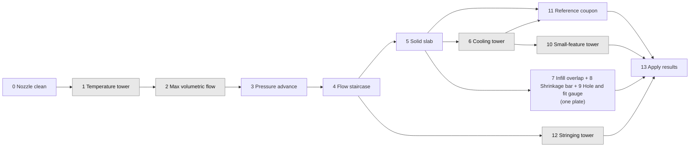

# Filament Dial-In plugin for PrusaSlicer 3.0

A PrusaSlicer 3.0 Lua plugin bundle that generates the complete set of test
prints for dialing in a filament, with the emphasis on parts printed at
**100% infill** and on getting the **same part out of several printers**.

Most calibration prints are designed to use as little filament as possible.
That hides exactly what goes wrong on a solid 24-hour PETG part: a fraction
of a percent of over-extrusion accumulating into XY growth and top-surface
ridges, material piling on the nozzle and dropping as blobs, thermal
shrinkage over 150 mm, and heat soak in thick sections. The parts here are
sized for those failures, and the plugin does the arithmetic (nominal volume,
expected mass, shrinkage and growth formulas) and engraves the numbers on the
part along with a printer tag, so coupons from five printers can be laid side
by side and read without notes.

Written against the API documented in
[prusaslicer-lua-plugins-api-doc](https://github.com/jedisct1/prusaslicer-lua-plugins-api-doc)
and PrusaSlicer `3.0.0-alpha11`. It runs entirely inside the sandbox: no files
are written, no network, nothing outside the selected project and presets.

## Install

1. In PrusaSlicer 3.0 choose **Plugins > Show User Plugins Folder**.
2. Copy the whole `com.ripleydynamics.filament-dialin` directory into it.
3. Choose **Plugins > Rescan Plugins**.
4. The commands appear under **Plugins > Filament Dial-In**.

An unpacked bundle needs no signature. To distribute a signed ZIP, generate a
key pair with `PrusaSlicer plugin keygen`, sign with
`PrusaSlicer plugin sign --private <key> ./com.ripleydynamics.filament-dialin`,
and place the public key at `<user data>/authorized_authors/ripley-dynamics.pem`
on each machine (see the API doc's packaging page).

## The commands

The Plugins menu lists them in this order. PrusaSlicer sorts commands by
their `id` (it keeps them in a map keyed by `<bundle id>.<id>`), not by
filename or menu label, so every command's id starts with its step number
(`01_temp_tower`, `03a_pa_line`, ...) and the Tools entries use 90 to 92.

| Menu entry | What it adds | What you read off it | What it feeds |
| --- | --- | --- | --- |
| 0. Nozzle clean before testing | Nothing on the plate. Names the Prusa-firmware maintenance file shipped in `assets/nozzle/` for the selected printer (MK4S, CORE One / One+ / One+ (Gen 2), CORE One L / L+) and nozzle (standard or High Flow): a `.bgcode` run from the USB stick that homes, parks high, purges nylon at 290 °C, cools with the fan and does the extruder-driven cold pull at 145 °C with the printer's own prompts. The MK4S also gets a PLA cold pull, a hot flush, a flow test and a brush-park file. The sheet offers the files as downloads | The tip you pulled: a clean cast of the nozzle bore, no grit, flecks or crust | Nothing. It makes every step below measure the printer instead of the residue in it |
| 1. Temperature tower | PrusaSlicer's own calibration model (80 × 10 mm base, 10 mm steps with bridges and overhangs), one `M104` per step, printed solid | Bridge sag, overhang fray, gloss, layer bonding | `temperature`, `first_layer_temperature` |
| 2. Max volumetric flow | PrusaSlicer's single-wall comb with one speed modifier per band, plus a solid label column; or a solid block | Highest band with no gaps, roughness or extruder clicking | `filament_max_volumetric_speed` |
| 3. Pressure advance › Line test (recommended) | OrcaSlicer's PA Line as first-layer G-code on a small anchor plate: one line per value (slow, fast, slow runs), the value written beside it in extruded digits, `M572` / `M900` / Klipper's command per line | The line whose fast run is as wide as its slow ends | `pressure_advance_value`, mode `enabled` |
| 3. Pressure advance › Tower (alternative) | Hollow two-perimeter tower with a notch (long runs and 90° corners), perimeters forced to 120 mm/s, one PA value per band, labels on a solid spine | Corner bulge (too little) or gaps after corners (too much) | same |
| 4. Flow staircase (M221) | One flat chip per flow value — 16 mm long, 30 mm wide, stacked on risers of three layers so they read as chips and not as steps — each printed at its own `M221`, labelled relative to 100, with an Archimedean-chords top. OrcaSlicer's one-pass sweep (-5 to +5% by 1), built the way Crepmähn's "Flow-Rate Calibration for PrusaSlicer" builds it | Top surface of each chip under a raking light | `extrusion_multiplier` (coarse) |
| 5. Solid slab (mass check) | 60 × 60 × 20 mm solid block, about 90 g, witness posts, nominal volume and expected mass engraved | Its weight on a 0.01 g scale, ridges on top, blobs on the posts | `extrusion_multiplier` (fine) |
| 6. Cooling tower | Square tower with an overhang wing per band and a slender pillar the head visits every layer, `M106` on every layer of a band, the preset's fan values pinned equal so the slicer's cooling logic stays quiet. With **Model: abyss** it prints the included Ultimate Fan Speed Test V3 instead (CC BY-NC 4.0, see Licensing), whose fan rises 1% per mm of height | The pillar first (fused or bulging layers = too little cooling), then the wings; lowest clean fan. On the abyss model the height in mm of the best band *is* the fan percentage | `min_fan_speed`, `max_fan_speed` |
| 7. Infill overlap calibration | Row of solid 25 mm blocks, each under a modifier with one overlap value | Top layer where infill meets the perimeters | `infill_overlap` |
| 8. Shrinkage and growth bar | 150 mm bar with two holes 130 mm apart, nominals engraved | Hole centre distance, width, hole diameter, corner lift on a flat surface | scale factor, `xy_size_compensation`; warp decides brim, bed temperature, enclosure |
| 9. Hole and fit gauge | Solid plate: clearance holes for a 6 mm pin (+0.0 to +0.5), a 3 to 20 mm hole row, two loose pins and 4 to 10 mm pegs, all one object | First hole the pin enters freely; hole and peg errors per size | design clearances, per-size hole allowances |
| 10. Small-feature tower | Pyramid, cone and 3/5/8 mm pillars on a plate | Height at which tips degrade | `slowdown_below_layer_time`, `min_print_speed`, fan on short layers |
| 11. Reference coupon | 50 × 25 × 10 mm solid body with a hole, an overhang wing on the +X end, and 0.8 / 1.2 / 1.6 mm fins on top | Dimensions, the wing's underside, whether each fin is solid | `xy_size_compensation`, `elefant_foot_compensation`, thin-wall settings |
| 12. Stringing tower | Two pillars, temperature and optional fan steps | Stringing per band | temperature, fan limits |
| 13. Apply dialed-in values | Nothing printed. Writes typed values into the selected presets and reads them back | The log or the helper's drawer | the presets |
| Tools / Apply values from profile.lua | Nothing printed. Writes the values the sheet saved for the selected printer | The log or the helper's drawer | the presets |
| Tools / Periodic nozzle wipe G-code | Nothing printed. Inserts a brush-wipe routine every N mm of height | | production prints, once a brush is fitted |
| Tools / Open the dial-in sheet | Nothing printed. Asks the helper to open the sheet in your browser (it reads PrusaSlicer's output); with no helper it only logs the address | | the sheet |

Every command that sweeps something takes the same five fields, because the
alpha11 param dialog has no dropdowns and no fields that appear only when they
are needed:

- **Lowest** and **Highest** — the two ends of the sweep. Both are printed when
  the interval divides the span evenly. Which end comes first is fixed per
  command and named in each label: the two temperature towers put the hottest
  section at the bottom, everything else climbs.
- **Choose by interval (on) or by number of sections (off)** — the switch
  between the two ways of filling the span. The wording follows what the
  command makes: sections, bands, lines, chips or blocks.
- **Interval** — used when the switch is on, and then it wins: the sweep steps
  by it from the lowest value and stops at or below the highest, so the number
  of sections is whatever fits (`235` to `260` by `5` gives six sections;
  by `4` it gives seven and stops at 259).
- **Number of sections** — used only when the switch is off, and then the span
  is divided evenly into that many values.

Fields where decimals matter (pressure advance, overlap, the interval for
either) are typed as text, so `0.005` and `5%` arrive intact; a comma works as
the decimal separator. A sweep is capped at 20 to 30 values depending on the
command, and a range that asks for more stops with an error instead of filling
the plate. Every part is engraved with the printer tag.

### Why this order, and what each step assumes

Each step changes one variable and assumes the earlier ones are already
applied to the presets. The sheet checks this from the `DATA` line every
command prints and warns when a step was printed with a different
temperature, multiplier, layer height, nozzle or print profile than the
earlier steps.

0. **Nozzle clean** before anything is measured. Residue from the last
   material holds flow back and shifts the temperature the plastic really
   reaches, and that difference ends up written down as a printer difference.
1. **Temperature** first, because flow, bridging and stringing all move
   with it. Printed solid on Prusa's model so heat soak in thick sections
   is part of the test.
2. **Max volumetric flow** next, because it measures the hotend rather than
   any setting, and because everything after it prints at the new limit. Set
   the filament's volumetric limit and cooling slowdown to 0 for this print
   (the command can write them, but see the caution below).
3. **Pressure advance** before flow, which is the order OrcaSlicer's
   calibration guide uses: corner bulge from too little PA and
   over-extrusion look alike, so the corners are made clean first and the
   flow chips are then easy to read. The line test is the quick one
   (minutes, first layer only); the tower is there for a closer look at
   corners. PrusaSlicer 3.0 stores PA in the filament preset (mode plus
   value); Prusa firmware can also self-calibrate it, and the line test
   checks that result. The line test needs the bed size, known for the
   XL / XL+ (360 × 360), CORE One / One+ / One+ (Gen 2) (250 × 220),
   CORE One L / L+ (300 × 300) and MK4S (250 × 210) from the printer name
   and typed in as the bed centre for anything else; it refuses a pattern
   that would run off the bed, and it refuses a printer profile that does
   not use relative E distances (the pattern's E values are relative moves).
4. **Flow**, at the chosen temperature, limit and PA. Orca's recommended
   sweep is one pass from -5 to +5% in 1% steps; halve the step for a closer
   look, or use the legacy two passes (-20 to +20 by 5, then 0 to -9 by 1)
   to get within 1% from a long way out. Apply the result before the slab.
5. **Slab, weighed**, at the new multiplier and limit. Mass is the precise
   flow measurement and also proves the hotend keeps up at the new speeds;
   if the slab is light, step 4 was too optimistic.
6. **Cooling** after the slab. Fan changes overhang quality and layer
   strength, but not the numbers the earlier steps measure, and a band that
   fuses or bulges while the flow is still a few percent out says nothing
   about cooling. It also pins the filament preset's fan values for its run,
   so it is kept away from the steps whose values are measured. Take the
   lowest fan that is clean; PETG loses layer strength as the fan goes up.
7. **Infill overlap** only after flow is right, since overlap and
   over-extrusion look alike on a top surface. Take the lowest overlap with
   no gap beside the innermost perimeter; too much overlap is what bulges
   solid parts.
8. **Shrinkage bar** separates thermal shrinkage from perimeter growth, and
   its corner lift on a flat surface is the warp reading: not a preset value,
   but what decides brim, bed temperature and enclosure for long solid parts.
9. **Hole and fit gauge** turns the compensation into design rules: the
   clearance a sliding fit needs, and how much more small holes shrink.
10. **Small-feature tower** checks the layer-time slowdown and fan rules
    where PETG overheats; the enclosure makes this printer-specific.
11. **Coupon** confirms everything on a part-like object and adds the
    overhang and thin-wall checks that a production part will meet.
12. **Stringing** is optional and machine-specific.
13. **Apply** and save the filament preset under the printer's name.

### Gates: what waits on what, and how to spread the work over several printers

Every step reads one result from the step before it, so the first six run in
series on each printer. After the slab the tests fan out. The sheet's Print
plan view draws this map live per printer; this is the fixed version.



Grey nodes are results that can be copied between printers of the same model
with the same hotend, nozzle and fan duct (temperature, volumetric limit,
cooling, small-feature rules, stringing; the shrinkage bar too, as it measures
the material). Every other step must run on every printer, because it
measures that machine's extruder or motion. Sharing is advisory: thermistors
and fans differ between identical machines, and a printer whose parts come out
different from its siblings should redo the grey steps itself.

### Three identical printers, one spool each

| Wave | Printer A | Printer B | Printer C |
|---|---|---|---|
| 1 | 0, then 1 temperature tower | 0, then wait | 0, then wait |
| 2 | 2 max volumetric flow | wait | wait |
| 3 | 3 pressure advance | 3 (A's temperature and limit copied in) | 3 (same) |
| 4 | 4 flow staircase | 4 | 4 |
| 5 | 5 solid slab | 5 | 5 |
| 6 | 6 cooling tower (shared later) | plate 7 + 8 + 9 | 12 stringing tower (shared) |
| 7 | plate 7 + 8 + 9 | 10 small-feature tower (A's cooling result) | plate 7 + 8 + 9 |
| 8 | 11 reference coupon | 11 | 11 |
| 9 | 13 apply (own profile entry) | 13 | 13 |

Nine sessions on the longest path instead of thirteen in series. The chain 0
to 5 cannot be shortened: each of those steps needs the previous result in
the preset, one variable at a time.

## Why parts differ between printers at 100% infill

Three separate effects add up, and each test isolates one:

- **Volumetric over-extrusion.** Extruder gear wear, hobbing depth and
  thermistor offset change how much plastic really comes out for a given E
  move, by a few percent between machines. At 15% infill that excess has room
  to go; at 100% it has none. It shows as ridges on the top surface, growth in
  X and Y, the nozzle plowing through the previous layer, and PETG collecting
  on the nozzle until it drops. The **slab** measures it directly: a solid
  block of known volume weighed on a scale gives the over-extrusion to about
  0.1%, better than any visual test. The **flow staircase** finds the right
  neighbourhood first.
- **XY growth of perimeters.** Squish and die swell push the outer wall
  outward by a fixed amount per side, independent of part size. The
  **coupon** and the **bar** measure it (outer width grows, holes shrink).
  Corrected with `xy_size_compensation`.
- **Thermal shrinkage.** PETG shrinks roughly 0.3 to 0.6% on cooling, so a
  150 mm part comes out 0.5 to 0.9 mm short while a 20 mm part looks fine. The
  **bar** measures it from the hole centre distance, where perimeter growth
  cancels. Corrected by scaling the model in PrusaSlicer (the Lua API cannot
  set scale).

## Procedure for Prusament PETG at 100% infill

Run this once per printer with the same spool, nozzle, layer height and
print profile, starting from the stock Prusament PETG profile. The sheet
(`wizard/index.html`) walks through it and does the arithmetic; the short
form:

0. **Nozzle clean**: run the printer's nylon cold-pull file from the USB
   stick (step 0 names it; the sheet downloads it), once per printer, before
   anything else is printed.
1. **Temperature tower**: 260 down to 235 °C in 5 °C bands. Choose the
   coolest clean band. Apply it (step 13 or the profile).
2. **Max volumetric flow** on the comb, 6 to 24 mm³/s. Limit = 85% of the
   highest clean band. Apply it.
3. **Pressure advance line**: 0.00 to 0.08 in 0.005 steps. The line whose
   fast run matches its slow ends. Apply it (mode enabled plus the value).
4. **Flow staircase**: one pass, -5 to +5% in 1% steps (or -20 to +20 by 5
   and then 0 to -9 by 1 for the two-pass method). Multiplier = current ×
   chosen % / 100. Apply it. Put `M221 S100` in the end G-code.
5. **Slab**: weigh it. Multiplier = printed multiplier × expected g /
   measured g. Apply it.
6. **Cooling tower**: 0 to 100% in 20% bands, or the abyss model, where the
   height in mm of the best band is the percentage. Lowest clean fan becomes
   the minimum; maximum 20% above. Discard the preset changes afterwards.
7. **Infill overlap**: 10 to 35% in 5% steps. Lowest value with no gap.
8. **Bar**: shrinkage from hole centres, XY growth from width and hole,
   corner lift on a flat surface.
9. **Hole and fit gauge**: first hole the pin enters freely; hole and peg
   errors per size.
10. **Small-feature tower**: where tips degrade; set slowdown and minimum
    speed.
11. **Coupon** with everything applied; measure, judge wing and fins, keep.
12. **Stringing** if needed.
13. **Apply and save** the filament preset per printer.

### Nozzle brush

Nozzle pickup is mostly cured by getting the mass right, but PETG will still
collect on a long print. Once a brush is mounted somewhere the nozzle can
reach (a gantry-mounted silicone or brass brush beside the bed is typical),
**Tools > Periodic nozzle wipe G-code** inserts a routine every N mm of
height: retract, lift, travel to the brush, scrub back and forth, lower,
unretract. Enter the brush position in printer coordinates and check it in
the G-code preview before printing. It assumes relative E and absolute XYZ,
which is how Prusa profiles are set up. It replaces the bed's custom
per-layer G-code list, so use it on production prints, not on the towers.

## The dial-in sheet (step-by-step companion)

PrusaSlicer's plugin API has no window or panel API; the only interface a
plugin gets is the automatic Run dialog. The step-by-step walkthrough
therefore lives beside PrusaSlicer as a single page:
[`wizard/index.html`](wizard/index.html). Open it in any browser, or run it
through the helper below. For each printer it shows which command to run and
the dialog values to type, takes your measurements, and computes the results:
the extrusion multiplier from the slab's mass, shrinkage and XY growth from
the bar, deviations on the coupon, and the final values for the Apply
command. Records stay in the browser; Export shows JSON to copy between
machines.

### profile.lua: the sheet's values inside the plugin

Step 13 of the sheet writes a `profile.lua`, keyed by printer name as
PrusaSlicer shows it, with the tag and the dialed-in values for each
printer. Put it in the bundle folder (the helper does this with one click)
and:

- every command engraves the profile's tag when the dialog's tag field is
  blank, so parts are labelled consistently without typing;
- **Tools > Apply values from profile.lua** writes the temperatures,
  multiplier, volumetric limit, pressure advance (value plus mode
  enabled), fan and slowdown values into the selected filament preset and the overlap into the print preset, in one click,
  instead of retyping them into command 13.

No rescan is needed after changing `profile.lua`; it is read on every Run.

### The helper: one button

`helper/dialin_helper.py` is a single standard-library Python script for the
PC that drives the printers. You do not have to type anything to run it:

1. Get this repository once: **Code > Download ZIP** on GitHub and unpack it
   anywhere, or `git clone https://github.com/Ripley-Dynamics/PrusaSlicer-3.0-Calibration-Suite`.
2. Double-click **`Dial-In Sheet.cmd`** in that folder (Windows). On macOS or
   Linux run **`./dialin-sheet.sh`** instead. Python 3 has to be installed; on
   Windows the file says so and waits if it is not, and the installer's
   "Add python.exe to PATH" box has to be ticked.

The window minimises itself and does this, in order:

1. **updates itself**: it downloads `helper/dialin_helper.py` from `main`,
   checks that it is valid Python, and if it differs it overwrites its own file
   and starts the new version once (`helper updated, restarting`);
2. **installs the latest plugin**: the same download as **Load latest plugin**
   below, into PrusaSlicer's user plugins folder, keeping your `profile.lua`;
3. **opens the dial-in sheet** at `http://127.0.0.1:8765/` in your browser;
4. **starts PrusaSlicer** when it knows where it is (installed builds, and
   portable zips unpacked in Downloads or on the Desktop), so its output lands
   in the sheet's log drawer. If it does not know, it says so and the sheet's
   **Paths…** button sets the path.

Steps 1 and 2 need the network; offline they log one line and are skipped, and
the sheet, the plugin that is already installed and PrusaSlicer still start.
Closing the window stops the helper (PrusaSlicer is left running).

Inside PrusaSlicer, **Plugins > Filament Dial-In > Tools > Open the dial-in
sheet** brings the sheet back if you closed the tab. It works when PrusaSlicer
was started by the helper, which is what reads that request out of its output;
started any other way, the command only prints the address into the log.

The terminal way still works, and is what the buttons in the sheet do:

```
python3 helper/dialin_helper.py --auto     # exactly what the one button runs
python3 helper/dialin_helper.py            # just serve the sheet, no updates
python3 helper/dialin_helper.py --update   # install the latest plugin and exit
python3 helper/dialin_helper.py --launch --prusaslicer ~/PrusaSlicer-alpha11
```

with `--port`, `--no-browser`, `--plugins-dir` and `--prusaslicer` as before.

The sheet gets a status bar and a log drawer from the helper:

- **Install from this checkout** copies the plugin into PrusaSlicer's user
  plugins folder (detected from the PrusaSlicer-alpha, -beta or release data
  folder; override with `--plugins-dir`). An existing `profile.lua` is kept.
- **Load latest plugin** needs no git: it downloads the current `main` branch
  of this repository as a zip, installs the bundle out of it (keeping your
  `profile.lua`), and refreshes this checkout's copy of the bundle, the sheet
  and this README so what you see matches what is installed. The installed
  commit is recorded in `INSTALLED.json` in the bundle and shown in the status
  bar (`bundle v0.2.0 · 06fb57c`). The same thing from the command line:
  `python3 helper/dialin_helper.py --update`, which installs and exits.
  If the download holds a newer `dialin_helper.py` the helper replaces its own
  file with it, but it cannot restart itself while it is answering that request
  (this process holds the socket), so the sheet says: close the helper window
  and double-click `Dial-In Sheet.cmd` again.
- **Save profile.lua** writes the sheet's profile straight into the bundle.
- **Launch PrusaSlicer** starts it as a child process and streams its
  output into the log drawer. The path is detected (installed builds, and
  portable zips unpacked in Downloads or on the Desktop) or set with
  `--prusaslicer`, which takes the executable or the folder of a portable
  zip. On Windows the helper runs `prusa-slicer-console.exe`; the GUI
  executable has no console output. A portable zip still keeps its user
  data, and therefore its plugins folder, under `%APPDATA%\PrusaSlicer-alpha`. Plugin errors, which PrusaSlicer otherwise only writes to its
  log, appear there in red.
- Every command prints one `DATA` line with the printer name, tag and its
  numbers. The helper forwards these and the sheet acts on them: it selects
  or creates the printer, jumps to that step, and records the slab's nominal
  volume and expected mass, the bar's nominal distances and the coupon's
  nominal sizes as PrusaSlicer computed them.

Measurements still come from your calipers and scale; the helper cannot
press Run in PrusaSlicer, and PrusaSlicer cannot read the sheet. Paths are
remembered in `dialin-helper.json` in your config folder.

### One build plate per test

PrusaSlicer 3.0 projects can hold several beds. The plugin always adds to
the bed that is currently selected and keeps custom per-layer G-code per
bed, but the API cannot create or select beds. So the routine for every
step is: add a bed (the + next to the bed tabs), select it, run the command.
The sheet repeats this reminder on each step.

## Things to know before running it

- **Numeric fields.** PrusaSlicer 3.0.0-alpha11 wires the `int` and `float`
  dialog controls in reverse, so whole-number fields are declared `int` and
  fields that need decimals (extrusion multiplier, compensation, extrusion
  width, density, sweep values) are declared as text and parsed. Every value
  is validated inside `execute`, and blank text fields mean "leave the preset
  value alone".
- **No dialog feedback.** A failed run is written to PrusaSlicer's log, not to
  the dialog. Start PrusaSlicer from a terminal, or through the helper, to
  see the `[filament-dialin]` lines that each command prints (expected mass,
  section speeds, values written, warnings).
- **Custom G-code is replaced.** The towers and the nozzle wipe clear the
  bed's custom G-code list before inserting their own entries (undo restores
  the old list).
- **Presets are modified, not saved.** Command 13 and Tools › Apply change
  the selected presets; command 6 pins the filament's fan values for its
  run (turn the option off to do it by hand) and command 2 does so only when its "write 0 into the
  preset's limits" option is on. The GUI shows them as modified. Switching
  printer or material profiles while presets are modified has crashed
  alpha11 (exit code 0xC0000409); save or discard the changes before
  switching.
- **One object per run.** PrusaSlicer centres each new object on the bed, so
  after adding two parts press **A** to arrange them.
- **Label text.** Labels are engraved 0.6 mm deep and shrunk to fit the face
  they sit on. A long printer name is shortened (`Original Prusa MK4S 0.4
  nozzle` becomes `MK4S 0.4`); type a short tag if you prefer.
- **Fan steps.** The stringing tower inserts `M106` per section. PrusaSlicer's
  own cooling logic may re-issue fan commands when it changes speed, so keep
  the filament's fan settings constant while running a fan sweep.
- **The fan test model is included, and it is the one non-commercial file.**
  Step 6 with **Model: abyss** prints the *Ultimate Fan Speed Test V3*
  (Printables model 200347, by Abyss, CC BY-NC 4.0), shipped at
  `assets/fan/ultimate-fan-test-v3.stl`. It ignores the fan fields and steps the
  fan 1% per mm of height on every layer, and adds a small solid plate with the
  printer tag beside the model, which carries no label of its own. If the file
  has been removed the command stops with an error naming the path and the
  model. See Licensing below before selling or bundling this plugin.
- **Setting keys.** The sweep plate passes the key straight to the slicer.
  An unknown key or one of an unsupported type (boolean, string, vector) is
  ignored silently by the alpha11 setter; the object list in PrusaSlicer shows
  what was really applied. `PrusaSlicer --export-config-schema schema.json`
  lists every key and type for your build.

## Development and tests

```
./run-tests.sh
```

needs Lua 5.4 (`lua5.4` or `lua` on the PATH). The runner mirrors
PrusaSlicer's two-stage lifecycle: every file is first evaluated without `api`
and `require`, as the discovery scan does, then each command is re-evaluated
in a sandbox with a mock of the alpha11 API (`test/mock_api.lua`) and its
`execute` is run with the dialog defaults and with variations. The mock keeps
the alpha11 quirks that matter: primitives report empty bounds, text meshes
report real bounds, percent and float-or-percent values come back opaque,
unknown keys are ignored by `set`, and custom G-code must be inserted in
ascending Z.

What the mock cannot check is the real slicer: run each command once on a
printer profile you care about and look at the result in the 3D view before
printing. Worth eyeballing the first time: label orientation on front and
back faces, that the flow chips carry their numbers in the front band of each
chip's top (the risers are far too low for a face label), that the overhang
wings attach to the +X side, that the volumetric tower's modifiers show
per-section speeds in the object list, and the nozzle wipe path in the G-code
preview.

## Layout

```
prusaslicer-filament-dialin/
  README.md                          this file
  Dial-In Sheet.cmd                  Windows: the one thing to double-click
  dialin-sheet.sh                    macOS/Linux: the same, in the foreground
  run-tests.sh                       runs the suite
  wizard/index.html                  the step-by-step dial-in sheet (offline page)
  helper/dialin_helper.py            serves the sheet beside PrusaSlicer, updates itself and the bundle, streams its output
  com.ripleydynamics.filament-dialin/   the bundle to copy into the user plugins folder
    manifest.json
    00_nozzle_clean.lua              0. hot purge and cold pull before testing
    01_temp_tower.lua                1. temperature tower on Prusa's model
    02_volumetric_tower.lua          2. max volumetric flow on Prusa's comb
    03_pa_line.lua                   3. pressure advance line test (Orca PA Line as first-layer G-code)
    03b_pa_tower.lua                 3. pressure advance tower (alternative)
    04_flow_stairs.lua               4. M221 flow staircase of flat chips
    05_slab.lua                      5. solid slab, mass check
    06_cooling_tower.lua             6. cooling tower with heat-soak pillar, or the fan test STL
    07_overlap.lua                   7. infill overlap calibration
    08_shrink_bar.lua                8. shrinkage and growth bar
    09_hole_fit_gauge.lua            9. hole and fit gauge
    10_small_feature_tower.lua       10. small-feature tower
    11_coupon.lua                    11. reference coupon
    12_stringing_tower.lua           12. stringing tower
    13_apply_results.lua             13. write values into presets
    tools_apply_profile.lua          Tools: write values from profile.lua
    tools_nozzle_wipe.lua            Tools: periodic nozzle wipe G-code
    tools_open_sheet.lua             Tools: ask the helper to open the dial-in sheet
    profile.lua                      (optional) written by the sheet or the helper
    THIRD_PARTY.md                   every third-party notice and design credit, in one place
    assets/prusa/                    Prusa's calibration STLs and comb SVG (AGPL-3.0-only)
    assets/fan/ultimate-fan-test-v3.stl  Ultimate Fan Speed Test V3 by Abyss (CC BY-NC 4.0, non-commercial)
    assets/fan/README.md             how that model is read, and its attribution
    lib/util.lua                     value parsing, preset readers, logging
    lib/label.lua                    engraved text on front, back and top faces
    lib/tower.lua                    stacked-section tower builder and overhang wing
  test/
    mock_api.lua                     stand-in for PrusaSlicer's api / VolumeType
    run_tests.lua                    discovery and execution tests
```

## Licensing

The code in this repository is **MIT**. Two sets of shipped assets are not, so
the bundle as a whole is
`MIT AND AGPL-3.0-only AND CC-BY-NC-4.0` (the string in `manifest.json`):

- **AGPL-3.0-only** — `assets/prusa/temp_tower-base.stl`,
  `assets/prusa/temp_tower-step.stl` and `assets/prusa/hreben.svg` are copied
  unchanged from PrusaSlicer 3.0.0-alpha11, Copyright Prusa Research a.s.
- **CC BY-NC 4.0, non-commercial** — `assets/fan/ultimate-fan-test-v3.stl` is
  "Ultimate Fan Speed Test V3" by **Abyss** (Printables model 200347), a remix
  of "Ultimate Fan Speed Test" and "Cooling direction test" by
  **@MarioL_3d_designer**, shipped unmodified in its 26 November 2025
  "new version angle v2" form. **This is the only file here that may not be
  used commercially:** if you sell this plugin, or ship it inside something you
  sell, delete that STL and let each user place their own copy. Step 6 still
  works — its built-in tower needs no asset, and `Model: abyss` then stops with
  an error naming the path and the model number.

`com.ripleydynamics.filament-dialin/THIRD_PARTY.md` carries the full notices
and the design credits for the geometry this bundle generates itself
(leotrax3d, Crepmähn).
